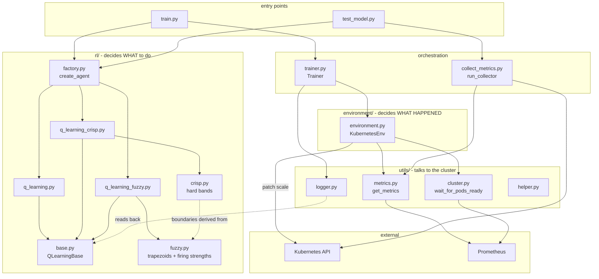
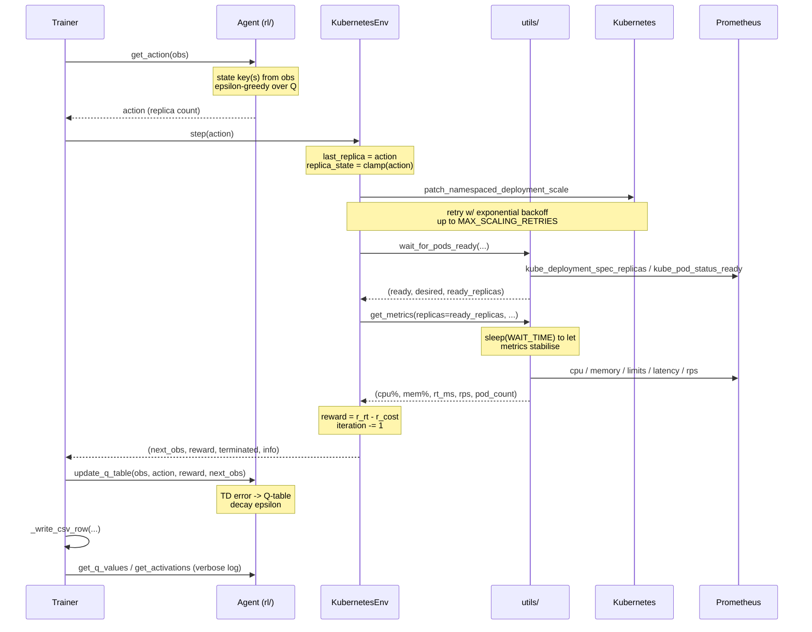
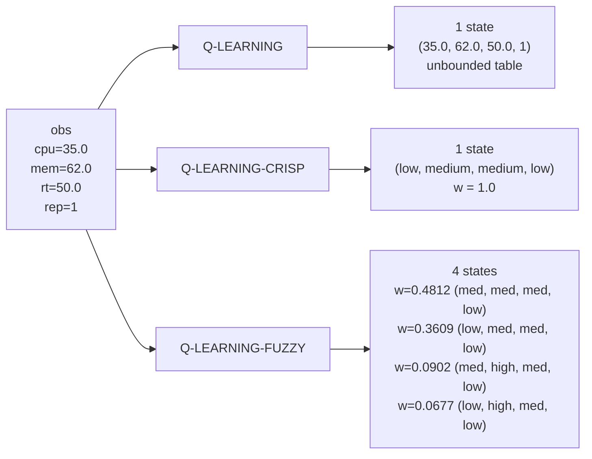

# Architecture

How the three agents work internally, and how they coordinate with
`environment/` and `utils/`.

For *why* the three models differ and what the comparison is testing, see
[README.md](README.md). This document is about mechanics.

---

## 1. Component map



The separation that matters:

| Layer | Responsibility | Knows about |
|---|---|---|
| `rl/` | Given an observation, pick a replica count. Learn from reward. | Nothing about Kubernetes or Prometheus |
| `environment/` | Apply the replica count, measure the result, score it. | Kubernetes + Prometheus, via `utils/` |
| `utils/` | Query the cluster, wait for readiness, format logs. | Prometheus queries, Kubernetes API |

**`rl/` has no cluster imports at all.** It is pure functions over dicts and
numpy arrays, which is why the whole package can be exercised without a cluster
(see [§9](#9-testing-without-a-cluster)).

---

## 2. The contract between layers

Everything crossing a layer boundary is a plain dict. There are exactly three.

### 2.1 The observation (`environment` → `rl`)

Produced by `KubernetesEnv._get_observation()`:

```python
{
    # --- state key fields: the ONLY four the agents read ---
    "cpu_usage":         float,  # 0-100, mean across ready pods, % of limit
    "memory_usage":      float,  # 0-100, mean across ready pods, % of limit
    "response_time":     float,  # 0-100, P90 latency as % of SLO (capped at 100)
    "last_replica":      int,    # replica count requested last step (1..MAX_REPLICAS)

    # --- auxiliary: logging only, never in a state key ---
    "response_time_ms":  float,  # raw P90 latency in ms
    "current_replicas":  float,  # replica count actually applied after clamping
}
```

The four state fields are declared once, in `rl/fuzzy.py`:

```python
METRICS = ("cpu_usage", "memory_usage", "response_time", "last_replica")
```

`Fuzzy.fuzzify()` filters `obs` against its own `memberships` dict, and
`Crisp.crispify()` iterates `METRICS` — so the auxiliary fields are ignored by
construction rather than by discipline. Adding a logging field to the
observation cannot silently change any agent's state space.

> **Note the unit split.** `response_time` in the observation is a *percentage of
> SLO* (capped at 100), because the agents need it on the same 0–100 scale as CPU
> and memory. The reward function uses `self.response_time`, the *raw ms*, and is
> deliberately **not** capped — see [§6.3](#63-reward).

### 2.2 The action (`rl` → `environment`)

A single `int`: the desired replica count, `1..n_actions`.

The Q-table is 0-indexed, so every agent converts at exactly one point:

```python
action     = int(np.argmax(q_values)) + 1   # selection: index -> replicas
action_idx = action - 1                     # update:    replicas -> index
```

### 2.3 The info dict (`environment` → `trainer`)

`env.step()` returns `(observation, reward, terminated, info)`. `info` merges the
reward breakdown, the observation, and episode accounting; `trainer.py` picks out
the CSV columns it needs and ignores the rest.

---

## 3. One training step, end to end



The loop lives in `Trainer.train()`:

```python
obs = self.env.reset()
while True:
    act = self.agent.get_action(obs)
    nxt, rew, term, info = self.env.step(act, q_table_size=len(self.agent.q_table))
    self.agent.update_q_table(obs, act, rew, nxt)
    total += rew
    self._write_csv_row(ep + 1, step, act, obs, info)
    obs = nxt
    if term:
        break
```

> **Ordering detail.** `_write_csv_row` is called with `obs` (the state acted
> *from*) before `obs = nxt` reassigns it. This matters for the `active_states`
> column: it must count the activations of the state the action was chosen from,
> not the state that followed.

---

## 4. The agents

### 4.1 Shared: `QLearningBase`

`rl/base.py` holds everything the three agents have in common, so the only code
that differs between them is the part under study.

| Member | Role |
|---|---|
| `sanitize(obs)` | `response_time` is `NaN`/absent before the first scrape lands → coerce to `0.0` |
| `ensure_state(key)` | Lazily allocate `np.zeros(n_actions)` for an unseen state |
| `select_action(q)` | Epsilon-greedy over a Q-value array → replica count |
| `get_q_values(obs)` | Q-values for an observation (**overridden by the fuzzy agent**) |
| `decay_epsilon()` | `epsilon = max(epsilon_min, epsilon * epsilon_decay)` |
| `save_model` / `load_model` | Pickle round-trip, tagged with `agent_type` |
| `show_model_summary` | Q-table dump; `format_state` is the per-agent hook |

Subclasses must implement three methods: `get_state_key`, `get_action`,
`update_q_table`.

Because `select_action` is shared, **exploration is identical across all three
agents** — same epsilon schedule, same `np.random` calls, same 1-based action
range. Only the Q-values fed into it differ.

`load_model` refuses a model whose saved `agent_type` doesn't match the loading
agent. A fuzzy Q-table keyed by `("low", "medium", ...)` would load into a crisp
agent without error and then quietly never hit a matching key — the guard turns
that silent wrong answer into a `ValueError`.

### 4.2 `Q-LEARNING` — conventional

**State key:** the observation, verbatim.

```python
def get_state_key(self, observation):
    self.sanitize(observation)
    return (
        observation["cpu_usage"],
        observation["memory_usage"],
        observation["response_time"],
        observation["last_replica"],
    )
```

A tuple of raw floats. `cpu_usage = 47.3182...` and `cpu_usage = 47.3183...` are
different states sharing nothing.

**Update:** textbook tabular Q-learning against a single key.

```
Q(s,a) += lr * [ r + γ · max_a' Q(s',a') − Q(s,a) ]
```

**Consequence:** the Q-table grows roughly one entry per step and almost every
lookup is a fresh state initialised to zeros. This is the control arm.

### 4.3 `Q-LEARNING-CRISP` — fuzzy boundaries, no fuzziness

**State key:** one hard band per metric, via `rl/crisp.py`.

```python
def label(self, value):
    if value < self.low_threshold:    # 35.0
        return "low"
    if value < self.high_threshold:   # 65.0
        return "medium"
    return "high"
```

The thresholds are **not hard-coded**. `rl/fuzzy.py` derives them from the same
trapezoids the fuzzy agent uses, as the midpoints of each overlap zone:

```python
def _overlap_midpoint(lower, upper):
    d_lower = TRAPEZOIDS[lower][3]   # low fades out at 40
    b_upper = TRAPEZOIDS[upper][0]   # medium fades in at 30
    return (b_upper + d_lower) / 2.0 # -> 35.0

CRISP_BOUNDARIES = (
    _overlap_midpoint("low", "medium"),   # 35.0
    _overlap_midpoint("medium", "high"),  # 65.0
)
```

Retuning a trapezoid moves the crisp agent with it, which is what keeps the
comparison honest: the two arms cannot drift apart through an edit to one of
them.

**Update:** identical to `Q-LEARNING`. Only `get_state_key` differs.

**Consequence:** at most `3⁴ = 81` states, so states are revisited and Q-values
actually converge. But the partition is hard — CPU 34.9 and 35.1 are different
states sharing nothing, which is the brittleness the fuzzy arm targets.

### 4.4 `Q-LEARNING-FUZZY` — multi-membership (FQL)

The only agent that overrides `get_q_values`, because one observation maps to
**many** states rather than one.

**Step 1 — fuzzify.** Each metric is normalised to 0–100 and scored against all
three trapezoids:

```python
TRAPEZOIDS = {
    "low":    (0.0,  0.0,  20.0, 40.0),
    "medium": (30.0, 45.0, 55.0, 70.0),
    "high":   (60.0, 80.0, 100.0, 100.0),
}
```

`normalize_observation()` handles two wrinkles:

- `last_replica` arrives as a count, not a percentage → `((v − 1) / (max_replicas − 1)) × 100`
- everything is clamped to `[0, 100]` — CPU can legitimately exceed its limit and
  report >100%, which would otherwise fall outside *every* trapezoid's support
  and leave the observation with no active membership at all

**Step 2 — combine.** `Fuzzy.get_activations()` takes the cartesian product of
each metric's *active* labels (degree > ε) and weights each combination by the
**product t-norm**, then normalises:

```
w(l_cpu, l_mem, l_rt, l_rep) = μ_cpu(l_cpu) · μ_mem(l_mem) · μ_rt(l_rt) · μ_rep(l_rep)
                             ⟶ normalised so Σ w = 1
```

A metric with 2 active labels doubles the number of active states, up to
`2⁴ = 16` when all four overlap.

**Step 3 — act and learn.** Weights drive both halves:

```python
def get_q_values(self, observation):
    q_values = np.zeros(self.n_actions)
    for state_key, weight in self.get_activations(observation):
        q_values += weight * self.ensure_state(state_key)
    return q_values
```

```python
current_q  = Σ_i w_i · Q(s_i, a)                       # aggregated estimate
best_next  = max(get_q_values(next_observation))       # aggregated bootstrap
td_error   = reward + γ · best_next − current_q        # computed ONCE
for s_i, w_i in activations:
    Q(s_i, a) += lr · w_i · td_error                   # credit ∝ membership
```

The TD error is computed once against the policy's *actual* aggregated estimate,
then shared out — not recomputed per state. A state the observation barely
belongs to is barely updated.

`get_state_key()` returns the single highest-weight state. It exists only for
logging and `show_model_summary`; **learning never uses it alone.**

**Worked example** (`cpu=35, mem=62, rt=50, last_replica=1`, `MAX_REPLICAS=10`):

```
cpu_usage     35    → low: (40−35)/(40−20) = 0.25    medium: (35−30)/(45−30) = 0.3333
memory_usage  62    → medium: (70−62)/(70−55) = 0.5333   high: (62−60)/(80−60) = 0.1
response_time 50    → medium: 1.0                    (45 ≤ 50 ≤ 55, the core)
last_replica  1     → normalised to 0.0 → low: 1.0

2 × 2 × 1 × 1 = 4 active states:

  raw product              normalised
  0.3333 × 0.5333 = 0.1778 → 0.4812   ('medium', 'medium', 'medium', 'low')
  0.25   × 0.5333 = 0.1333 → 0.3609   ('low',    'medium', 'medium', 'low')
  0.3333 × 0.1    = 0.0333 → 0.0902   ('medium', 'high',   'medium', 'low')
  0.25   × 0.1    = 0.0250 → 0.0677   ('low',    'high',   'medium', 'low')
                    Σ 0.3694 → Σ 1.0
```

After one update with `reward=1.0, lr=0.5, action=3` (so `td_error = 1.0`), each
state moves by exactly `lr · w_i · td_error`:

```
w=0.4812 → Q = +0.240602      w=0.0902 → Q = +0.045113
w=0.3609 → Q = +0.180451      w=0.0677 → Q = +0.033835
```

### 4.5 Side by side

Same observation, three state representations:



| | `Q-LEARNING` | `Q-LEARNING-CRISP` | `Q-LEARNING-FUZZY` |
|---|---|---|---|
| Key type | `tuple[float, ...]` | `tuple[str, ...]` | `tuple[str, ...]` |
| States per obs | 1 | 1 | 1–16 |
| Max table size | unbounded | 81 | 81 |
| Overrides `get_q_values` | no | no | **yes** |
| Updates per step | 1 state | 1 state | up to 16, weighted |
| Behaviour at a boundary | n/a | hard switch | blended |

The boundary row is the crux. Moving CPU 34 → 36:

- **crisp** — `('low', …)` → `('medium', …)`. Different states, nothing shared.
- **fuzzy** — both observations activate the *same* 4 states; only the weights
  shift. The policy varies continuously instead of jumping.

---

## 5. `rl/factory.py`

One lookup table maps the `ALGORITHM` env var to a class:

```python
AGENTS: dict[str, Type[QLearningBase]] = {
    "Q-LEARNING":       QLearning,
    "Q-LEARNING-CRISP": QLearningCrisp,
    "Q-LEARNING-FUZZY": QLearningFuzzy,
}
```

`train.py` and `test_model.py` both call `create_agent(...)`, so the two entry
points cannot drift apart in how they construct an agent. An unknown value raises
listing the valid options, rather than defaulting to one arm of the experiment.

`resolve_model_type()` (in `base.py`) maps `agent_type` → directory name
(`qlearning`, `qlearningcrisp`, `qlearningfuzzy`), keeping each arm's checkpoints
and CSVs apart.

---

## 6. `environment/` — `KubernetesEnv`

The agent's entire view of the cluster. It has no idea which algorithm is driving
it: `self.algorithm` is carried for logging only, and **no branch in this file
reads it**. That is deliberate — it is what makes "same environment, different
state abstraction" true rather than aspirational.

### 6.1 `step(action)`

```python
self.last_replica = action                                        # 1. remember request
self.replica_state = max(min_replicas, min(action, max_replicas)) # 2. clamp
self._scale_and_get_metrics()                                     # 3. apply + measure
reward, breakdown = self._calculate_reward()                      # 4. score
self.iteration -= 1                                               # 5. count down
terminated = bool(self.iteration <= 0)
observation = self._get_observation()                             # 6. next state
```

> **`last_replica` is the requested action, not the applied one.** If the agent
> asks for 15 with `MAX_REPLICAS=10`, `last_replica = 15` while
> `current_replicas = 10`. The agents fuzzify/bin `last_replica`, and
> `normalize_observation` clamps it back to 100% — so the state stays in range
> even when the request doesn't.

### 6.2 `_scale_and_get_metrics()`

Three cluster interactions in fixed order:

1. **`_scale()`** — `patch_namespaced_deployment_scale`, retried with exponential
   backoff (delay `1s → 30s`, timeout `60s → 300s`). Handles etcd timeouts (500)
   and concurrent-modification conflicts (409) distinctly. After
   `MAX_SCALING_RETRIES` it logs `CRITICAL` and returns rather than raising —
   a stuck cluster degrades the episode instead of losing the whole run.
2. **`wait_for_pods_ready()`** (`utils/cluster.py`) — blocks until Prometheus
   agrees the deployment's ready-pod count matches desired.
3. **`get_metrics()`** (`utils/metrics.py`) — sleeps `WAIT_TIME`, then scrapes.

The `ready_replicas` from step 2 is passed as `replicas=` into step 3, which uses
it as the expected result count. If pods never became ready, metrics are gathered
for however many *are* ready rather than blocking forever.

### 6.3 Reward

Identical for all three agents — the whole comparison rests on this.

```python
r_rt   = 1.0 - (self.response_time / self.max_response_time)
r_cost = (self.replica_state - self.min_replicas) / self.range_replicas
reward = r_rt - r_cost
```

| | at best | at threshold | at worst |
|---|---|---|---|
| `r_rt` | `+1.0` (rt = 0ms) | `0.0` (rt = SLO) | `−1.0` (rt = 2×SLO) |
| `r_cost` | `0.0` (min replicas) | — | `+1.0` (max replicas) |

Both components land in comparable ranges, so no weighting term is needed, and
`r_cost = 0` at `min_replicas` handles the boundary without a special case.

Two details worth holding onto:

- **`r_rt` uses raw ms and is uncapped**, so exceeding the SLO goes properly
  negative and keeps a gradient. The observation's `response_time` *is* capped at
  100% — a deliberate split: the state space stays bounded, the reward signal
  doesn't saturate.
- `range_replicas = max(1, max_replicas − min_replicas)` guards division by zero
  when `min == max`.

### 6.4 Episode accounting

`reset()` scales back to `min_replicas`, restores `iteration`, zeroes
`episode_reward` and increments `episode_number`. `cumulative_reward` is **not**
reset — it spans the whole run, for sample-efficiency curves.

---

## 7. `utils/` — the cluster-facing layer

### 7.1 `metrics.py`

The only module that knows PromQL. `get_metrics()` returns
`(cpu_mean, mem_mean, response_time_ms, request_rate, collected_pods)`.

Queries are composed from one shared building block, `_build_scope_ready_query()`,
which resolves *ready pods belonging to this deployment* by joining
`kube_pod_status_ready` → `kube_pod_owner` → `kube_replicaset_owner`. Every other
query `AND on(pod)`s against it, so CPU, memory and limits are always measured
over the same pod set.

| Function | Returns |
|---|---|
| `_build_cpu_usage_query` | `rate(container_cpu_usage_seconds_total[interval])` per pod |
| `_build_memory_usage_query` | `container_memory_working_set_bytes` per pod |
| `_build_cpu_limits_query` / `_build_memory_limits_query` | `kube_pod_container_resource_limits` per pod |
| `_build_request_rate_query` | `rate(app_requests_total[interval])`, excluding `/metrics` and `/healthz` |
| `_get_response_time` | `histogram_quantile(q, app_request_latency_seconds_bucket)` × 1000 → ms, meaned across endpoints |

**Usage is always a percentage of limit, never absolute.** `_calculate_cpu_percentages`
divides each pod's rate by that pod's limit; a pod with no limit is skipped with a
warning, not counted as zero. `_calculate_memory_percentages` then restricts
itself to the pod set that produced valid CPU readings, so both means cover the
same denominators.

This is why the deployment manifests **must** set `resources.limits` — without
them the agent sees no usable metrics at all.

`_fetch_metric_with_retry` polls until the result count matches the expected
replica count or the timeout expires; `get_metrics` only returns once
`collected == replicas`. On timeout it returns all zeros, which the reward reads
as `rt = 0` → `r_rt = +1.0`. **A scrape failure therefore looks like a perfect
step.** Watch the `Timeout reached while fetching metrics` log line when a run
looks implausibly good.

### 7.2 `cluster.py`

`wait_for_pods_ready()` polls two scalar queries — desired
(`kube_deployment_spec_replicas`) and ready — and returns
`(ready, desired_replicas, ready_replicas)`. It waits for the *desired* count to
match the request first, confirming Prometheus has observed the scale patch,
before checking readiness. `NaN` (metric not yet populated) is retried rather
than parsed. On timeout it returns `ready=False` and the env logs a warning and
proceeds.

### 7.3 `logger.py`

`setup_logger()` — console + rotating file handler under `logs/<timestamp>/`,
with a UTF-8 emit shim for Windows consoles.

`log_verbose_details()` renders the per-step block. It reaches back into the agent
through two **duck-typed hooks**:

| Hook | Who has it | Used for |
|---|---|---|
| `get_q_values(obs)` | all three (base) | `Qmax` / `Best` — the fuzzy agent's override means it reports *weighted* Q-values across all active states |
| `get_activations(obs)` | fuzzy only | the extra `N active states →` line |

Asking the agent rather than indexing `q_table` directly is what makes the fuzzy
agent report what it actually acts on. `_safe_q_values` swallows exceptions and
degrades to `n/a`: verbose logging must never take down a run.

### 7.4 `helper.py`

Pure parsing, no I/O: `parse_cpu_value` (`100m` → `0.1`), `parse_memory_value`
(`512Mi` → `512.0`), `normalize_endpoints` (JSON / literal / list / bare string →
`list[tuple[str, str]]`).

---

## 8. `trainer.py` and `collect_metrics.py`

### `Trainer`

Owns the episode loop, checkpointing and CSV. Typed against `QLearningBase`, so it
works with any of the three without branching.

- **Checkpoint on improvement** — `_save_checkpoint` fires whenever an episode's
  total beats the best so far, into
  `model/{model_type}/{start_time}_{note}/checkpoints/`.
- **Interrupt-safe** — SIGINT/SIGTERM handlers save to `interrupted/` before
  re-raising, then restore the original handlers.
- **CSV per step** — columns match the actual reward breakdown (`r_rt`, `r_cost`),
  plus `active_states` from the optional `get_activations` hook (always `1` for
  the non-fuzzy agents, 1–16 for fuzzy).

`_count_active_states` degrades to `1` when the hook is absent, so the column is
directly comparable across all three arms.

### `collect_metrics.py`

An independent sampler on a fixed wall-clock interval, reusing the same
`utils/metrics.py` query builders. `test_model.py` runs it on a daemon thread so
metrics are sampled on a steady cadence regardless of how long each agent step
takes; `run_collector` skips `signal.signal` when off the main thread.

Stopped via the module-level `collect_metrics._running = False`, then joined.

---

## 9. Testing without a cluster

`rl/` imports only `numpy` and `urllib3` — no `kubernetes`, no
`prometheus_api_client`. Any agent can be driven with hand-built dicts:

```python
from rl import create_agent

agent = create_agent(
    algorithm="Q-LEARNING-FUZZY",
    learning_rate=0.5, discount_factor=0.95,
    epsilon_start=0.0,  # deterministic
    epsilon_decay=0.99, epsilon_min=0.01,
    created_at=0, n_actions=10, logger=logger,
)

obs = {
    "cpu_usage": 35.0, "memory_usage": 62.0,
    "response_time": 50.0, "last_replica": 1,
    "response_time_ms": 500.0, "current_replicas": 1.0,
}

agent.get_activations(obs)          # -> 4 (state_key, weight) pairs, Σw = 1.0
agent.update_q_table(obs, 3, 1.0, obs)
```

Invariants worth asserting when changing `rl/`:

- `Σ w_i == 1.0` for any observation
- a core value (`cpu=50`) yields exactly 1 activation with `w = 1.0`
- all four metrics overlapping yields exactly 16
- after one update, `ΔQ(s_i, a) == lr · w_i · td_error`
- `Crisp.label`: `34.9 → low`, `35.0 → medium`, `64.9 → medium`, `65.0 → high`
- fuzzy shares states across `cpu = 34 ↔ 36`; crisp shares none

---

## 10. Adding a fourth agent

1. Subclass `QLearningBase` in `rl/`, set `agent_type` and `state_column_header`.
2. Implement `get_state_key`, `get_action`, `update_q_table`. Override
   `get_q_values` only if one observation maps to several states.
3. Register it in `AGENTS` (`rl/factory.py`) and in `resolve_model_type`
   (`rl/base.py`).
4. Add a deployment + service + ServiceMonitor in `inference-app-dipa/`, and a
   route in `ingress.rule.yaml`.

No change to `environment/`, `trainer.py` or `utils/` should be required. If one
is, the new agent probably isn't comparable to the other three.
